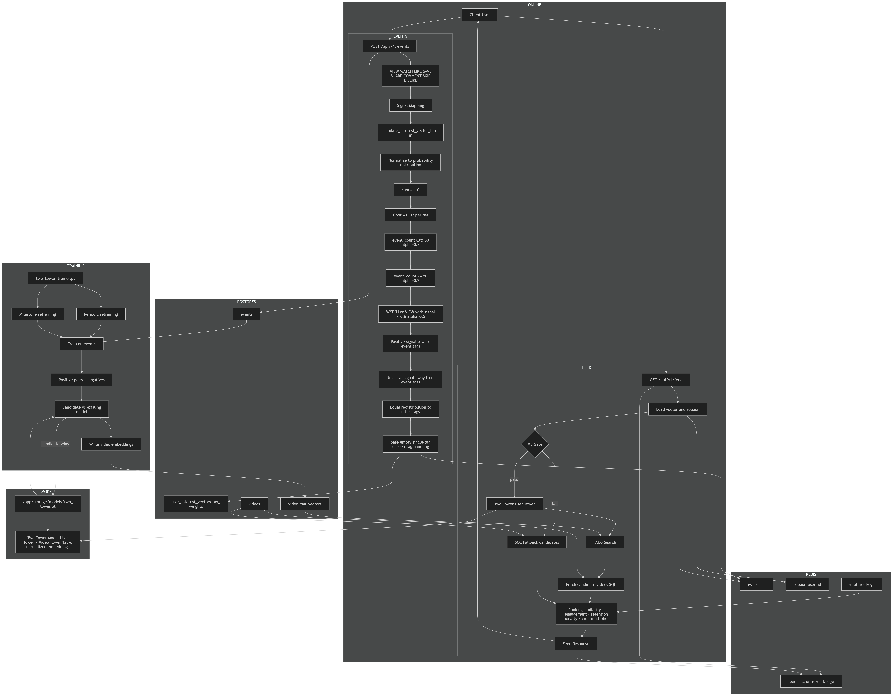
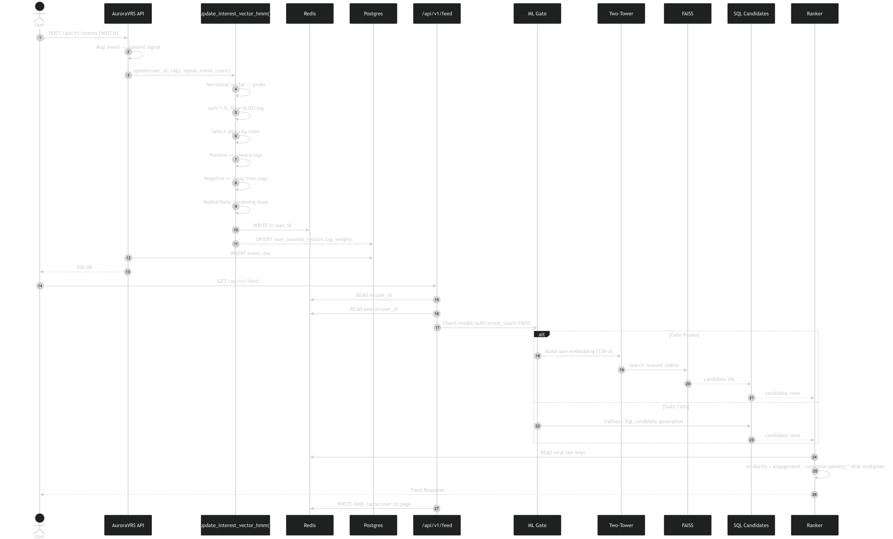

# AuroraVRS Backend Architecture

This document describes the AuroraVRS backend as a single system: API, authentication, content lifecycle, event ingestion, HMM-based interest updates, feed generation, Two-Tower retrieval, FAISS search, ranking, caching, worker retraining, and deployment topology. It is intentionally explicit so the architecture can be understood without guessing.

Evidence base used:
- `api/main.py`
- `api/core/auth.py`
- `api/core/config.py`
- `api/core/db.py`
- `api/core/faiss_index.py`
- `api/core/ranking.py`
- `api/core/two_tower.py`
- `api/routers/auth.py`
- `api/routers/users.py`
- `api/routers/videos.py`
- `api/routers/feed.py`
- `api/routers/events.py`
- `api/routers/misc.py`
- `worker/two_tower_trainer.py`
- `api/migrations/init.sql`
- `docker-compose.yml`
- `api/Dockerfile`
- `worker/Dockerfile`
- `tests/test_ranking_hmm.py`

Date captured: 2026-04-25

## Architecture Diagrams

### Backend Recommendation System Architecture


### Feed Generation Process (Existing and New Users)


### Sequence Diagram 1



### Sequence Diagram 2



---

## 1. System Overview

AuroraVRS is a recommendation backend built around a hybrid architecture:

1. FastAPI exposes auth, user, content, event, and feed endpoints.
2. A Two-Tower neural model embeds users and videos into a shared 128-dimensional space.
3. FAISS retrieves candidate videos by approximate nearest-neighbor search.
4. A ranking layer blends semantic similarity, engagement, penalties, and viral boosts.
5. An HMM-style online interest updater maintains the user’s live tag distribution.
6. A worker service retrains the model and regenerates embeddings over time.
7. A creator-affinity layer tracks follows and creator-level actions so creator-specific posts can be recommended directly.
8. Postgres is the source of truth; Redis is the fast state and cache layer.

This is not a single-model API. It is a coordinated request-time and training-time system.

---

## 2. Runtime Components

### 2.1 API service
The API is the request-time surface. It:
- loads the Two-Tower checkpoint from `/app/storage/models/two_tower.pt`
- initializes a FAISS index
- serves feed requests
- writes events
- updates user interest state
- exposes admin model-control endpoints

### 2.2 Worker service
The worker is the offline-learning surface. It:
- loads recent event data
- builds training pairs
- trains a candidate Two-Tower model
- compares the candidate to the current model
- writes the selected model checkpoint
- regenerates video embeddings

### 2.3 Persistence layers
Postgres stores canonical data:
- users, privacy, settings
- refresh tokens
- follows
- videos, tags, categories, comments, likes, dislikes, shares
- events
- user interest vectors
- video embeddings
- feed sessions
- trending snapshots

Redis stores live and transient state:
- `iv:user_id` live interest vectors
- `feed_cache:user_id:page`
- `session:user_id` seen-video lists
- viral tier markers
- rollout stage and serve counters
- trending leaderboards
- invalidation markers
- creator affinity snapshots

### 2.4 Deployment topology
The intended full deployment uses Docker Compose with:
- `db`
- `redis`
- `api`
- `worker`
- `nginx`

---

## 3. API Surface

### 3.1 Health and root
- `GET /health` returns API status.
- `GET /` returns a minimal welcome payload.

### 3.2 Authentication
The auth router supports:
- register
- login
- refresh
- logout
- change password

The backend uses JWT access tokens and refresh tokens.

### 3.3 Users
The user router supports:
- `GET /api/v1/users/me`
- `PUT /api/v1/users/me`
- `GET /api/v1/users/{id}`
- `POST /api/v1/users/{id}/follow`
- `DELETE /api/v1/users/{id}/follow`
- `GET /api/v1/users/{id}/followers`
- `GET /api/v1/users/{id}/following`

Follow and unfollow now also update creator-affinity state and clear the user's feed cache immediately.

### 3.4 Videos
The video router supports:
- listing public videos
- search
- individual lookup
- upload start and completion
- registration for seeded/imported content
- deletion
- privacy updates
- view counting
- like, dislike, save, and comment writes

### 3.5 Feed
The feed router exposes the main recommendation endpoint:
- `GET /api/v1/feed`

### 3.6 Events
The event router exposes the event ingestion endpoint:
- `POST /api/v1/events`

### 3.7 Miscellaneous
The misc router exposes:
- content categories and tags
- stubbed notifications
- analytics read access for videos

### 3.8 Admin ML controls
The API also exposes:
- `GET /api/v1/ml/status`
- `POST /api/v1/ml/reload-model`
- `POST /api/v1/ml/rebuild-index`

These are admin-protected.

---

## 4. Identity and Authorization

### 4.1 Token model
The backend uses JWT-based authentication. A typical client flow is:
1. Login or register.
2. Receive an access token and refresh token.
3. Send `Authorization: Bearer <token>` on protected requests.
4. Use `GET /api/v1/users/me` to confirm identity and role.

### 4.2 Roles
The backend distinguishes at least:
- `USER`
- `ADMIN`

Some model-control endpoints require `ADMIN`.

---

## 5. Content and Lifecycle

### 5.1 Users
User profiles carry:
- names
- email
- bio
- avatar URL
- role
- settings and privacy metadata

### 5.2 Videos
Videos carry:
- creator
- title and description
- type: `QUICK` or `LONGFORM`
- privacy: `PUBLIC`, `PRIVATE`, or `UNLISTED`
- status: upload/processing/readiness state
- duration
- file and manifest metadata
- counts and engagement metrics

### 5.3 Tags and categories
Video semantics are driven by tags and categories. These are stored as normalized many-to-many relationships and used by both training and serving.

### 5.4 Engagement primitives
The backend maintains:
- views
- likes
- dislikes
- saves
- shares
- comments

These are both product features and training signals.

---

## 6. Event Ingestion and HMM Interest State

### 6.1 Event endpoint role
`POST /api/v1/events` is the central ingestion point for interaction signals.

### 6.2 Event types
The backend treats the following event types as meaningful:
- `VIEW`
- `WATCH`
- `LIKE`
- `SAVE`
- `SHARE`
- `COMMENT`
- `SKIP`
- `DISLIKE`

### 6.3 What happens when an event arrives
When an event is posted, the backend:
1. stores the event in `events`
2. increments the user’s event count if the user is authenticated
3. resolves the video’s tags and categories
4. converts the event into a numeric signal
5. updates the live interest vector through `update_interest_vector_hmm`
6. stores the result in Redis and Postgres
7. updates trending and viral state
8. invalidates feed caches if needed

### 6.4 Signal mapping
The event signal map is:
- `VIEW` / `WATCH`: `watch_ratio`
- `LIKE`: `0.6`
- `SAVE`: `1.2`
- `SHARE`: `1.0`
- `COMMENT`: `0.4`
- `SKIP`: `-0.5`
- `DISLIKE`: `-1.0`

### 6.5 HMM interest updater
The HMM updater replaces the old EMA-style update logic.

It treats the user’s interest vector as a probability distribution, not a signed score map.

Core invariants:
- the vector sums to exactly `1.0`
- each tag stays at or above `0.02`
- legacy inputs are normalized before update
- empty and single-tag vectors are handled safely
- unseen tags can be introduced safely

Alpha rules:
- `event_count < 50` -> `alpha = 0.8`
- `event_count >= 50` -> `alpha = 0.2`
- `VIEW` or `WATCH` with `watch_ratio >= 0.6` -> `alpha = 0.5`

Update behavior:
- positive signals move mass toward the event tags
- negative signals move mass away from the event tags
- redistribution is balanced across the remaining tags

### 6.6 Why the HMM matters
This component is the online memory of the user. It changes what the system thinks the user is interested in before the next feed request happens. The Two-Tower model then consumes that evolving state.

---

## 7. Feed Request Flow

### 7.1 Feed endpoint
`GET /api/v1/feed` is the main recommendation endpoint.

### 7.2 Request-time sequence
At a high level, the feed request does this:
1. check Redis for a cached feed page
2. load the current user interest vector
3. load region and session state
4. check whether the ML retrieval path is eligible
5. if eligible, encode the user and search FAISS
6. if not eligible, build SQL fallback candidates
7. score the candidate pool
8. sort by final score
9. write back cache and session state
10. return the feed payload

### 7.3 ML eligibility gate
The ML retrieval path is only used when:
- the model is loaded
- the user is authenticated
- `event_count >= MIN_EVENTS_FOR_MODEL`
- the FAISS index is ready

If any condition is missing, the feed uses fallback SQL candidate generation.

### 7.4 Cold-start fallback
The fallback path exists for:
- unauthenticated users
- low-activity users
- model startup gaps
- FAISS readiness gaps
- ML errors

The fallback path is not a failure state. It is a deliberate supported mode.

---

## 8. Candidate Generation

### 8.1 Candidate sources
Candidate videos come from a blended set of sources:
1. trending videos
2. followed creators
3. tag-similar videos
4. region-similar videos
5. discovery videos subject to rollout controls

The backend also merges in creator-affinity candidates so creators the user follows or repeatedly engages with can surface even when the ML retrieval path is active.

### 8.2 Deduplication
Candidates are deduplicated by video ID.

### 8.3 Filtering
Candidates are filtered against:
- already seen items
- visibility rules
- status `READY`
- privacy `PUBLIC`

### 8.4 Rollout-aware discovery
The discovery pool is controlled by rollout staging and serve counts. This prevents every new or low-confidence video from being shown too aggressively.

---

## 9. Two-Tower Retrieval

### 9.1 Model structure
The Two-Tower model consists of:
- a user tower
- a video tower

Both towers produce 128-dimensional normalized embeddings.

### 9.2 Inputs to the user tower
The user tower consumes:
- a weighted semantic embedding aggregate derived from the user’s tag distribution
- user metadata like event count and account age
- a latent ID embedding derived through a hashing trick

### 9.3 Inputs to the video tower
The video tower consumes:
- a semantic embedding aggregate derived from the video’s tags and categories
- video metadata like view count, like rate, watch ratio, age, and duration
- a latent ID embedding derived through a hashing trick

### 9.4 Output
The model returns normalized embeddings that can be compared by dot product.

### 9.5 Role in the system
The Two-Tower model is the retrieval brain. It is not the only ranking mechanism, but it supplies the semantic candidate neighborhood for the feed.

---

## 10. FAISS Retrieval

### 10.1 FAISS index role
FAISS stores and searches video embeddings so the backend can quickly retrieve semantically similar videos for a user.

### 10.2 Index type
The implementation uses inner-product search.

### 10.3 Index behavior
The API:
- initializes the index at startup
- rebuilds it periodically every 30 minutes
- can trigger a manual rebuild through an admin endpoint

### 10.4 Vector source
The index is built from `video_tag_vectors`. If a video vector is missing, the API can compute it on the fly using the model.

### 10.5 Why FAISS is needed
The catalog is larger than a simple SQL sort can support well at request time. FAISS gives semantic retrieval with low latency.

---

## 11. Final Ranking

### 11.1 Score components
After candidate retrieval, the backend scores each video using:
- similarity to the user embedding
- candidate-pool-normalized engagement metrics
- a low-retention penalty
- a viral multiplier

### 11.2 Engagement metrics
The ranking layer evaluates:
- watch ratio
- like rate
- comment rate
- share rate
- save rate

### 11.3 Viral multiplier
Redis stores viral tier labels such as:
- `WATCH`
- `HOT`
- `VIRAL`
- `MEGA_VIRAL`

These tiers increase score weight for strong performers.

### 11.4 Output
The feed response includes:
- `videos`
- `has_more`
- `next_cursor`

---

## 12. Caching and Session State

### 12.1 Feed cache
The backend caches page results per user and page number.

### 12.2 Seen session state
The backend stores seen video IDs in Redis so it can avoid repetitive loops during a session.

### 12.3 Cache invalidation
Caches are invalidated when user activity materially changes the interests, especially on strong engagement actions and viral promotion events.

Follow and unfollow are treated as immediate feed-changing actions and also invalidate the user's cached pages.

---

## 13. Trending and Rollout

### 13.1 Trending scores
The backend updates trending leaderboards from engagement velocity.

### 13.2 Viral tiering
Videos are tiered using z-score-like thresholds into watch/hot/viral/mega-viral classes.

### 13.3 Rollout stages
Discovery uses rollout stages to manage how aggressively new content is exposed.

---

## 14. Worker Training Loop

### 14.1 Purpose
The worker is the offline training and embedding refresh loop.

### 14.2 Training data
It reads recent events, user interest state, user metadata, video metadata, and tag/category mappings.

### 14.3 Positive and negative examples
It treats likes, shares, and sufficiently watched views as positives and uses random negatives for contrastive learning.

### 14.4 Evaluation
The worker trains a candidate model and compares it against the current model. Only a sufficiently better candidate replaces the current checkpoint.

### 14.5 Embedding refresh
After model selection, the worker regenerates video embeddings and writes them to `video_tag_vectors`.

---

## 15. End-to-End Event Path

1. A client posts an event to `/api/v1/events`.
2. The event is stored in Postgres.
3. The event is mapped to a signal.
4. `update_interest_vector_hmm` normalizes and updates the live interest distribution.
5. Redis and Postgres are updated with the new state.
6. Trending and viral state are refreshed.
7. The next feed request sees the updated preferences.
8. Feed retrieval and ranking change accordingly.

This is the system’s online learning loop.

---

## 16. End-to-End Feed Path

1. The client requests `/api/v1/feed`.
2. The API checks cached results.
3. It loads the user interest vector and session state.
4. It checks ML eligibility.
5. If eligible, it uses the model and FAISS to retrieve candidates.
6. If not, it uses SQL fallback sources.
7. It ranks the candidates.
8. It stores the response in cache.
9. It returns the feed.

This is the system’s request-time inference loop.

---

## 17. Operational Endpoints

### 17.1 Health
`GET /health` is the basic service liveness check.

### 17.2 Model status
`GET /api/v1/ml/status` reports whether the model and index are ready.

### 17.3 Reload model
`POST /api/v1/ml/reload-model` reloads the checkpoint from disk.

### 17.4 Rebuild index
`POST /api/v1/ml/rebuild-index` reloads the model and starts a new FAISS rebuild.

These are admin-only operations.

---

## 18. Configuration

The main required environment values are:
- `DATABASE_URL`
- `REDIS_URL`
- `SECRET_KEY`

Other relevant values include:
- `MIN_EVENTS_FOR_MODEL`
- `TWO_TOWER_RETRAIN_INTERVAL_HOURS`
- `VIDEO_STORAGE_PATH`
- `MODEL_STORAGE_PATH`

---

## 19. Validation

The repository includes deterministic tests for the HMM updater in `tests/test_ranking_hmm.py`.

The tests validate:
- sum invariance
- probability floor enforcement
- legacy normalization
- watch override behavior
- empty and single-tag safety
- new tag introduction

These tests matter because the online interest vector is mathematically constrained.

---

## 20. What the Backend Is Optimizing For

AuroraVRS is optimized for:
- fast feed generation
- stable online interest updates
- semantic retrieval over a large video catalog
- cache-aware request handling
- periodic offline model improvement
- graceful fallback when the ML path is unavailable

It is a recommendation system with stateful online adaptation, not just a REST API.

---

## 21. Summary

The whole backend works together like this:

- Events update a live probability-based interest vector using HMM logic.
- That vector is written to Redis and Postgres.
- The feed endpoint reads the live state and decides whether to use ML retrieval.
- The Two-Tower model converts user state and content metadata into embeddings.
- FAISS retrieves similar videos efficiently.
- The ranking layer orders candidates with similarity, engagement, penalties, and viral boosts.
- The worker retrains the model and refreshes embeddings over time.

That is the full architecture end to end.
# AURORA-VRS API Documentation
> **Integration Guide for Dashboard Team**

## 🌐 API Connectivity
*   **Base URL:** `http://62.84.176.140:8080` (Standard communication port)
*   **API Path:** `/api/v1/`
*   **Format:** JSON (UTF-8)

---

## 🛠️ System Overview
### **GET** `/health`
Returns the operational status of the API.
* **Returns:** `200 OK` `{"status": "ok"}`

---

## 🔐 Authentication & Authorization
The AuroraVRS API uses **JWT (JSON Web Tokens)** for secure authentication. 

### **Dashboard Workflow**
1.  **Identity Check**: Call `/api/v1/auth/login`.
2.  **Role Verification**: After login, call `/api/v1/users/me`.
    *   Inspect `role`: If it is `"ADMIN"`, the dashboard should unlock management features.
3.  **Token Persistence**: Save the `access_token`. 
4.  **Header Usage**: Include the token in **every** subsequent request:
    `Authorization: Bearer <access_token>`

---

### **POST** `/api/v1/auth/register`
Creates a new user account securely hashed with `bcrypt`.
* **Payload:** 
  ```json
  {
    "email": "user@example.com", 
    "password": "strongPassword123!", 
    "names": "Full Name"
  }
  ```
* **Returns (200 OK):** 
  ```json
  {
    "access_token": "eyJhbGciOi...", 
    "refresh_token": "a1b2c3d4e5..."
  }
  ```

# AuroraVRS Backend Architecture

This document describes the full AuroraVRS backend as it currently exists in this repository: API, feed generation, HMM-based interest updates, Two-Tower retrieval, FAISS indexing, ranking, persistence, worker retraining, and deployment topology. It is written to be implementation-oriented and explicit about how the pieces work together.

Evidence base used:
- `api/main.py`
- `api/core/auth.py`
- `api/core/config.py`
- `api/core/db.py`
- `api/core/faiss_index.py`
- `api/core/ranking.py`
- `api/core/two_tower.py`
- `api/routers/auth.py`
- `api/routers/users.py`
- `api/routers/videos.py`
- `api/routers/feed.py`
- `api/routers/events.py`
- `api/routers/misc.py`
- `worker/two_tower_trainer.py`
- `api/migrations/init.sql`
- `docker-compose.yml`
- `api/Dockerfile`
- `worker/Dockerfile`
- `tests/test_ranking_hmm.py`

Date captured: 2026-04-25

---

## 1. System Summary

AuroraVRS is a video recommendation backend built around a hybrid retrieval and ranking stack:

1. A FastAPI API exposes auth, user, video, feed, and event endpoints.
2. A Two-Tower neural model encodes users and videos into a shared 128-dimensional space.
3. FAISS performs approximate nearest-neighbor retrieval over video embeddings.
4. A ranking layer blends semantic similarity, engagement metrics, viral boosts, and penalties.
5. A new HMM-style interest updater maintains the user’s live tag distribution as a normalized probability vector.
6. A worker service periodically retrains the model and regenerates video embeddings.
7. Postgres stores canonical data and pgvector embeddings; Redis stores live state, caches, and trending metadata.

The system is not a single model. It is a coordinated pipeline where online state, offline training, retrieval, and ranking all feed into each other.

---

## 2. Runtime Topology

### 2.1 API process
The API is the request-time entrypoint. It:
- loads the Two-Tower checkpoint from `/app/storage/models/two_tower.pt`
- starts a FAISS rebuild loop
- serves the feed
- writes events
- updates user state
- exposes ML admin endpoints

### 2.2 Worker process
The worker is the training-time entrypoint. It:
- loads recent interaction events
- builds training pairs
- trains a candidate Two-Tower model
- evaluates whether the candidate is better than the current model
- writes the selected model checkpoint
- regenerates video embeddings in the database

### 2.3 State stores
- Postgres is the source of truth for users, videos, events, tags, categories, follows, saves, dislikes, comments, interest vectors, and video embeddings.
- Redis is the low-latency store for live interest vectors, feed caches, session seen lists, viral tiers, rollout stages, trending scores, and short-lived invalidation markers.

### 2.4 Container topology
In the intended full deployment, Docker Compose runs:
- `db`
- `redis`
- `api`
- `worker`
- `nginx`

---

## 3. Data Model

### 3.1 Core tables
The database schema includes:
- `users`
- `user_settings`
- `user_privacy`
- `refresh_tokens`
- `follows`
- `categories`
- `tags`
- `videos`
- `video_tags`
- `video_categories`
- `likes`
- `dislikes`
- `comments`
- `shares`
- `events`
- `user_interest_vectors`
- `video_tag_vectors`
- `feed_sessions`
- `trending_snapshots`

### 3.2 Important fields
Key fields used by the backend logic include:
- `users.role` for authorization (`USER`, `ADMIN`)
- `videos.status` for upload and processing state
- `videos.privacy` for public/private visibility
- `videos.view_count`, `like_count`, `dislike_count`, `comment_count`, `share_count`, `avg_watch_ratio`, `engagement_velocity`
- `events.event_type` and `events.watch_ratio`
- `user_interest_vectors.tag_weights` for live interest state
- `user_interest_vectors.event_count` for ML gating
- `video_tag_vectors.vector` for retrieval embeddings

### 3.3 Vector contract
The current convention is:
- model outputs are 128-dimensional
- database vector columns are 256-dimensional
- stored vectors are padded with zeros in the trailing half
- FAISS uses the first 128 dimensions for retrieval

This is important because serving, storage, and retrieval do not all use the same dimensionality literally, even though they represent the same semantic embedding space.

---

## 4. Authentication and Identity

### 4.1 Auth model
Authentication is JWT-based.

The API supports:
- registration
- login
- refresh token exchange
- logout
- password change

### 4.2 Auth flow
The typical flow is:
1. The client calls `/api/v1/auth/register` or `/api/v1/auth/login`.
2. The API returns an access token and refresh token.
3. The client includes `Authorization: Bearer <access_token>` on protected requests.
4. The backend derives the current user from the token.

### 4.3 Authorization levels
The backend distinguishes at least two roles:
- `USER`
- `ADMIN`

Admin-only endpoints include ML status and model reload/rebuild actions.

---

## 5. Content Lifecycle

### 5.1 Users
The user router provides:
- `GET /api/v1/users/me`
- `PUT /api/v1/users/me`
- `GET /api/v1/users/{id}`
- `POST /api/v1/users/{id}/follow`
- `DELETE /api/v1/users/{id}/follow`
- `GET /api/v1/users/{id}/followers`
- `GET /api/v1/users/{id}/following`

These endpoints manage profile state and follow relationships, which are used later for candidate generation.

### 5.2 Videos
The video router provides:
- public listing
- search
- individual lookup
- upload start and completion
- registration for seeded/imported content
- deletion
- privacy updates
- view counting
- like/dislike/save/comment writes

The video lifecycle is:
1. Create or upload a video.
2. Store metadata in Postgres.
3. Mark it `READY` once the content is usable.
4. Attach tags and categories.
5. Make it available for retrieval, feed ranking, and training.

### 5.3 Content metadata
Video ranking depends on:
- creator
- privacy
- type (`QUICK` or `LONGFORM`)
- counts and ratios
- semantic tags and categories
- age of the video

---

## 6. Event Ingestion and HMM Interest State

### 6.1 Event endpoint
`POST /api/v1/events` is the central ingestion endpoint for interaction signals.

Events can represent:
- `VIEW`
- `WATCH`
- `LIKE`
- `SAVE`
- `SHARE`
- `COMMENT`
- `SKIP`
- `DISLIKE`

The event payload includes:
- `video_id`
- `event_type`
- `watch_ratio`
- `metadata`

### 6.2 What happens on event ingest
When an event arrives, the backend:
1. Inserts the event row into `events`.
2. Updates high-intent counters like likes, saves, or shares where relevant.
3. Updates `user_interest_vectors.event_count` for authenticated users.
4. Fetches the tags and categories associated with the video.
5. Computes a signal value from the event type.
6. Calls `update_interest_vector_hmm`.
7. Writes the new vector to Redis as `iv:user_id`.
8. Persists the same vector to `user_interest_vectors.tag_weights` in Postgres.
9. Invalidates feed caches when appropriate.
10. Updates trending/viral state for the video.

### 6.3 Signal mapping
The backend converts event types into a numeric signal:
- `VIEW` and `WATCH` use `watch_ratio`
- `LIKE` uses `0.6`
- `SAVE` uses `1.2`
- `SHARE` uses `1.0`
- `COMMENT` uses `0.4`
- `SKIP` uses `-0.5`
- `DISLIKE` uses `-1.0`

### 6.4 HMM interest updater
The HMM logic replaces the older EMA-style updater.

It treats the interest vector as a probability distribution over tags, not as signed weights.

Core rules:
- The vector must sum to exactly `1.0`.
- Each tag must stay at or above `0.02`.
- Legacy vectors are normalized into valid probability distributions before update.
- Empty vectors and single-tag vectors are handled safely.
- New unseen tags can be introduced safely.

Dynamic alpha:
- `event_count < 50` -> `alpha = 0.8`
- `event_count >= 50` -> `alpha = 0.2`
- `VIEW` or `WATCH` with `watch_ratio >= 0.6` -> `alpha = 0.5`

Update behavior:
- Positive signal: probability mass moves toward the event tags.
- Negative signal: probability mass moves away from the event tags.
- Redistribution is balanced across the remaining tags so the total stays at `1.0`.

### 6.5 Why the HMM matters
This component is the online memory of the user. It changes what the system thinks the user is interested in before the next feed request happens. The Two-Tower model then consumes that evolving state.

---

## 7. Feed Generation

### 7.1 Feed endpoint
`GET /api/v1/feed` is the main recommendation endpoint.

The request can include:
- `page`
- `limit`
- `video_type`

### 7.2 Feed request flow
The feed endpoint works in this order:
1. Look for a cached page in Redis.
2. Load the current user’s interest vector and metadata.
3. Load seen video IDs from session state.
4. Check whether the ML path is eligible.
5. If eligible, encode the user and query FAISS.
6. If not eligible or if ML fails, fall back to SQL candidate generation.
7. Score the candidate pool.
8. Sort by final score.
9. Write back session and cache state.
10. Return the feed response.

### 7.3 ML gate
The ML path is only used when all are true:
- a Two-Tower model is loaded
- the user is authenticated
- `event_count >= MIN_EVENTS_FOR_MODEL`
- the FAISS index is ready

If any of these conditions fails, the backend uses fallback SQL candidate generation.

### 7.4 Cold-start fallback
The fallback path exists for:
- unauthenticated users
- low-activity users
- model startup gaps
- FAISS readiness gaps
- ML errors

The fallback path is not a failure state. It is a deliberate supported mode.

---

## 8. Candidate Generation

### 8.1 Candidate sources
Candidate videos come from a blended set of sources:
1. trending videos
2. followed creators
3. tag-similar videos
4. region-similar videos
5. discovery videos subject to rollout controls

### 8.2 Deduplication
Candidates are deduplicated by video ID.

### 8.3 Filtering
Candidates are filtered against:
- already seen items
- visibility rules
- status `READY`
- privacy `PUBLIC`

### 8.4 Rollout-aware discovery
The discovery pool is controlled by rollout staging and serve counts. This prevents every new or low-confidence video from being shown too aggressively.

---

## 9. Two-Tower Retrieval

### 9.1 Model structure
The Two-Tower model consists of:
- a user tower
- a video tower

Both towers produce 128-dimensional normalized embeddings.

### 9.2 Inputs to the user tower
The user tower consumes:
- a weighted semantic embedding aggregate derived from the user’s tag distribution
- user metadata like event count and account age
- a latent ID embedding derived through a hashing trick

### 9.3 Inputs to the video tower
The video tower consumes:
- a semantic embedding aggregate derived from the video’s tags and categories
- video metadata like view count, like rate, watch ratio, age, and duration
- a latent ID embedding derived through a hashing trick

### 9.4 Output
The model returns normalized embeddings that can be compared by dot product.

### 9.5 Role in the system
The Two-Tower model is the retrieval brain. It is not the only ranking mechanism, but it supplies the semantic candidate neighborhood for the feed.

---

## 10. FAISS Retrieval

### 10.1 FAISS index role
FAISS stores and searches video embeddings so the backend can quickly retrieve semantically similar videos for a user.

### 10.2 Index type
The implementation uses inner-product search.

### 10.3 Index build behavior
The API:
- builds the index at startup
- rebuilds it periodically every 30 minutes
- can rebuild it manually through an admin endpoint

### 10.4 Input to the index
The index uses video embeddings from `video_tag_vectors` where available. If a vector is missing during index build, the backend can compute one from the model.

### 10.5 Why FAISS is needed
The model alone is not enough for low-latency retrieval over the full catalog. FAISS gives an efficient retrieval layer between user embeddings and the video corpus.

---

## 11. Final Ranking

### 11.1 Score components
After candidate generation, the backend scores each video using:
- similarity to the user embedding
- engagement metrics normalized within the current candidate pool
- a low-retention penalty
- a viral multiplier

### 11.2 Engagement metrics
The scored metrics include:
- watch ratio
- like rate
- comment rate
- share rate
- save rate

### 11.3 Formula shape
The final score is based on:
- roughly half semantic similarity
- roughly half engagement quality
- then penalty/boost adjustments

The exact internal code uses normalized pool statistics and a viral multiplier from Redis.

### 11.4 Viral multiplier
Videos can be boosted by viral tier state stored in Redis:
- `WATCH`
- `HOT`
- `VIRAL`
- `MEGA_VIRAL`

The multiplier increases with tier strength.

### 11.5 Output formatting
The feed returns:
- `videos`
- `has_more`
- `next_cursor`

---

## 12. Caching and Session State

### 12.1 Feed cache
Per-user, per-page feed responses are cached in Redis.

### 12.2 Seen session list
The backend stores seen video IDs in Redis so it can avoid infinite repetition in a session.

### 12.3 Cache invalidation triggers
Feed cache invalidation happens when:
- strong user actions occur
- viral promotions happen
- interest state changes materially

### 12.4 Why this matters
Without session and cache state, the feed would be repetitive and would not react quickly enough to new user behavior.

---

## 13. Trending, Rollout, and Viral Controls

### 13.1 Trending scoring
The backend computes a velocity-like score for videos and stores trending leaderboards in Redis.

### 13.2 Viral tiering
The system uses z-score style thresholds to label videos as:
- `WATCH`
- `HOT`
- `VIRAL`
- `MEGA_VIRAL`

### 13.3 Rollout stages
Videos can move through staged discovery thresholds based on performance. This prevents a video from being shown everywhere at once before it has proven itself.

### 13.4 Discovery gating
Low-view and recent videos are handled through discovery logic that respects rollout stage and serve count.

---

## 14. Worker Training Loop

### 14.1 Training cadence
The worker runs continuously and retrains the model on a schedule.

### 14.2 Training data
Training uses recent events joined with user and video metadata.

### 14.3 Positive examples
The worker treats likes, shares, and sufficiently watched views as positive training examples.

### 14.4 Negative sampling
For each positive pair, random negatives are sampled to train the model to separate good matches from bad matches.

### 14.5 Validation and replacement
The worker trains a candidate model and compares it to the current one. Only if the candidate improves enough does it replace the stored model.

### 14.6 Embedding regeneration
After selecting a model, the worker regenerates video embeddings and stores them in `video_tag_vectors`.

### 14.7 Why the worker matters
This is the offline learning loop. It lets the retrieval model improve over time even though live requests are using cached state and fast inference paths.

---

## 15. End-to-End Request Path

This is the full path for a logged-in user:

1. The user opens the app and requests `/api/v1/feed`.
2. The API checks Redis for a cached page.
3. If the cache misses, the API loads the user’s current interest vector.
4. If the user just generated events, the HMM state already reflects those events.
5. The API checks whether ML retrieval is eligible.
6. If eligible, the Two-Tower model encodes the user.
7. FAISS returns semantically similar video candidates.
8. SQL loads full video rows for those candidates.
9. The ranking layer computes final scores.
10. The API stores session and cache updates in Redis.
11. The response returns to the client.

This is the central loop of the backend.

---

## 16. End-to-End Event Path

This is the full path for a single interaction event:

1. The client sends an interaction event to `/api/v1/events`.
2. The backend stores the event in Postgres.
3. The backend calculates the event signal.
4. The HMM updater normalizes the current vector.
5. The HMM updater redistributes mass according to the event.
6. The updated vector is written to Redis and Postgres.
7. The next feed request sees the updated state.
8. The feed request uses that state to change retrieval and ranking.

This is the core online adaptation loop.

---

## 17. Admin and Operational Endpoints

### 17.1 Health check
`GET /health` returns the API status.

### 17.2 ML status
`GET /api/v1/ml/status` reports model and index readiness.

### 17.3 Model reload
`POST /api/v1/ml/reload-model` reloads the model checkpoint from disk.

### 17.4 Index rebuild
`POST /api/v1/ml/rebuild-index` reloads the model and triggers a FAISS rebuild.

These endpoints are admin-protected.

---

## 18. Configuration

### 18.1 Required environment values
The backend expects at least:
- `DATABASE_URL`
- `REDIS_URL`
- `SECRET_KEY`

Optional operational values include:
- `MIN_EVENTS_FOR_MODEL`
- `TWO_TOWER_RETRAIN_INTERVAL_HOURS`
- `VIDEO_STORAGE_PATH`
- `MODEL_STORAGE_PATH`

### 18.2 Default behavior
If a config value is missing, the backend uses sensible defaults where the code allows it, but the database and Redis URLs are required for normal operation.

---

## 19. Tests and Verification

### 19.1 HMM tests
The repository includes deterministic tests for the HMM updater in `tests/test_ranking_hmm.py`.

These cover:
- sum invariant
- hard floor behavior
- legacy normalization
- watch override
- empty vector initialization
- single-tag safety
- introduction of new tags

### 19.2 Why these tests matter
The HMM logic is mathematically constrained. If any of these invariants break, the user interest state becomes unstable and the feed path becomes harder to reason about.

---

## 20. What the Backend Is Optimizing For

The backend is optimized for:
- fast feed generation
- online adaptation to user behavior
- stable probability-based interest state
- semantic retrieval over a large catalog
- periodic offline improvement of the retrieval model
- cache-aware request handling

It is not a simple CRUD API. It is a recommendation system with stateful online learning, approximate retrieval, and ranking heuristics.

---

## 21. Summary

The AuroraVRS backend works as one connected system:

- Events update a probability-based HMM interest vector.
- That interest vector is stored in Redis and Postgres.
- The feed endpoint reads the live state and decides whether to use ML retrieval.
- The Two-Tower model turns user state and video metadata into embeddings.
- FAISS retrieves similar videos quickly.
- The ranking layer combines similarity, engagement, penalties, and viral boosts.
- The worker continuously retrains the model and refreshes video vectors.

That is the full architecture, end to end.
