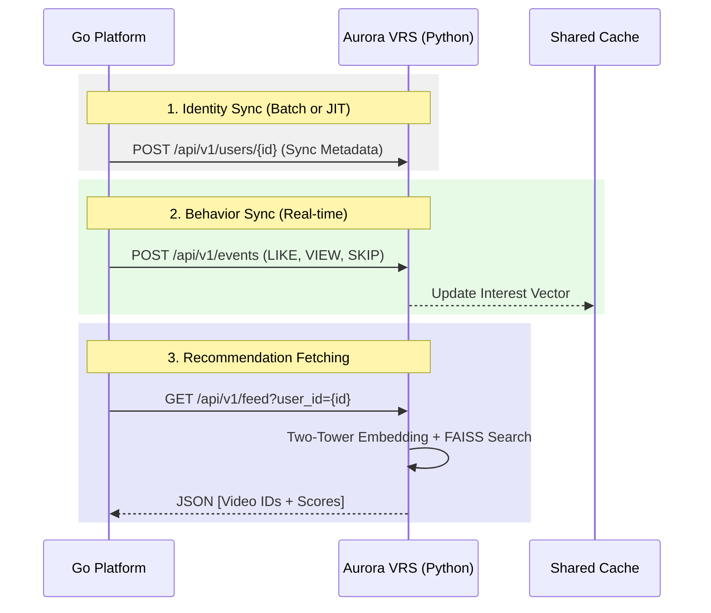

# Aurora VRS <> Go Integration Guide

This guide provides the exact technical specifications for connecting your **Go-based Video Platform** to the **Aurora Recommendation System (VRS)**.

## 1. High-Level Architecture
Aurora acts as a specialized microservice that provides "Intelligence" (Ranking & Discovery) while your Go platform handles "Delivery" (Playlists & Streaming).



---

## 2. Go Client Implementation

### A. Data Structures
Define these structs in your Go project to match Aurora's API responses:

```go
package aurora

import (
    "time"
    "fmt"
    "net/http"
    "encoding/json"
    "bytes"
)

// Video represents the metadata returned by Aurora
type Video struct {
	ID            string    `json:"id"`
	Title         string    `json:"title"`
	Description   string    `json:"description"`
	ManifestURL   string    `json:"manifest_url"`
	ViralTier     string    `json:"viral_tier"` // "HOT", "VIRAL", "MEGA_VIRAL"
	Tags          []string  `json:"tags"`
	ViewCount     int       `json:"view_count"`
	LikeCount     int       `json:"like_count"`
}

// FeedResponse is the wrapper for the /feed endpoint
type FeedResponse struct {
	Videos     []Video `json:"videos"`
	HasMore    bool    `json:"has_more"`
	NextCursor string  `json:"next_cursor"`
}

// EventRequest is used to sync user behavior
type EventRequest struct {
	VideoID    string  `json:"video_id"`
	EventType  string  `json:"event_type"` // "VIEW", "LIKE", "SKIP", "DISLIKE"
	WatchRatio float64 `json:"watch_ratio"` // 0.0 to 1.0
}
```

### B. The Integration Client
Use a robust HTTP client with timeouts:

```go
type Client struct {
	BaseURL    string
	HTTPClient *http.Client
	APIKey     string
}

func NewClient(baseURL, apiKey string) *Client {
	return &Client{
		BaseURL: baseURL,
		APIKey:  apiKey,
		HTTPClient: &http.Client{
			Timeout: 2 * time.Second, // Aurora is fast, don't wait forever
		},
	}
}

// GetPersonalizedFeed fetches the ranked list for a user
func (c *Client) GetPersonalizedFeed(userID string, limit int) (*FeedResponse, error) {
	url := fmt.Sprintf("%s/api/v1/feed?user_id=%s&limit=%d", c.BaseURL, userID, limit)
	
	req, _ := http.NewRequest("GET", url, nil)
	req.Header.Set("Authorization", "Bearer "+c.APIKey)

	resp, err := c.HTTPClient.Do(req)
	if err != nil { return nil, err }
	defer resp.Body.Close()

	var result FeedResponse
	if err := json.NewDecoder(resp.Body).Decode(&result); err != nil {
		return nil, err
	}
	return &result, nil
}

// SyncEvent sends interaction data to Aurora
func (c *Client) SyncEvent(userID string, event EventRequest) error {
	body, _ := json.Marshal(event)
	req, _ := http.NewRequest("POST", c.BaseURL+"/api/v1/events", bytes.NewBuffer(body))
	
	req.Header.Set("Authorization", "Bearer "+c.APIKey)
	req.Header.Set("X-User-ID", userID) // Tell Aurora who the user is
	req.Header.Set("Content-Type", "application/json")

	resp, err := c.HTTPClient.Do(req)
	if err != nil { return err }
	resp.Body.Close()
	return nil
}
```

---

## 3. Detailed Endpoint Specs

### 📡 The "Behavior" Pipe (`POST /api/v1/events`)
**Goal**: Tell Aurora what the user likes so it can learn.
- **When to fire**: 
    - On every Video Completion (Event: `VIEW`, `watch_ratio: 1.0`).
    - On every Like/Dislike click.
    - On every "Skip" (if user leaves video after < 3 seconds).
- **Criticality**: **High**. This is the only way Aurora builds the "Interest Vector."

### 📡 The "Identity" Pipe (`POST /api/v1/users/{id}`)
**Goal**: Sync user attributes for improved cold-start.
- **Fields to sync**: `region`, `account_age`, `language_preference`.
- **How it's used**: Aurora uses `region` to serve trending videos local to that user before they have a personalized history.

### 📡 The "Intelligence" Pipe (`GET /api/v1/feed`)
**Goal**: Fetch the ranked videos.
- **Inputs**: `user_id`.
- **Logic**: Aurora identifies if the user is a "Heavy User" (>50 events). 
    - **If Yes**: Uses the **Two-Tower Neural Model** + **FAISS** for deep matching.
    - **If No**: Uses **Z-Score Trending** + **Regional Popularity** (Cold Start).

---

## 4. Performance Checklist
1. **Asynchronous Events**: Do NOT wait for the `SyncEvent` call to finish before returning to your user. Fire it in a Go `goroutine` or a worker pool.
2. **Result Hydration**: Aurora returns Video IDs and basic metadata. If your Go platform needs extra fields (like high-res thumbnails), hydrate them from your own DB using the IDs returned by Aurora.
3. **Caching**: If Aurora returns `has_more: true`, cache the next batch in your Go platform's local memory to make the next "scroll" feel instant.
